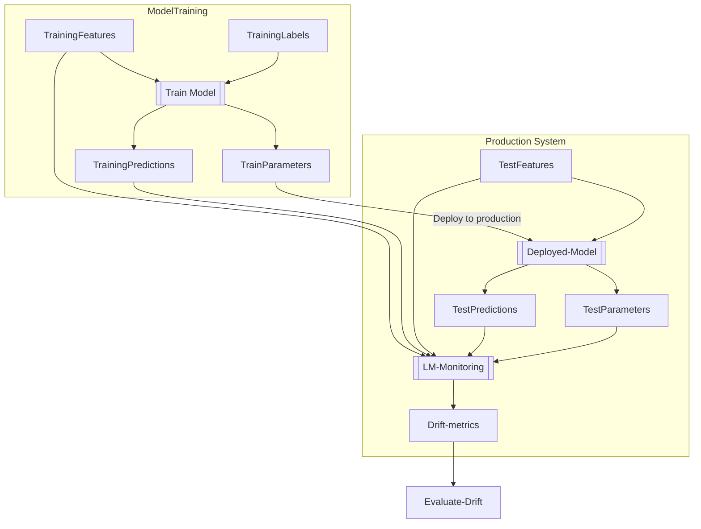

# Learning Machines: monitoring models in the wild

## Background
A typical ML workflow consists of:
- Preprocessing
- Feature engineering
- Model Training and evaluation
- Hyper parameter tuning

The key goal of supervised learning is to build models that have a high level of out-of-sample prediction accuracy. During training it is common to measure predictive accuracy using a held-out dataset or using cross validation.

Models may then be deployed in a production environment (the wild). Unfortunately the model's predictive accuracy may degrade over time. A key reason for accuracy degredation is that the _data generating process_ has altered in some way such that the distribtion of data the model encounters is different from that which the training data was sampled from.

The data generating process may change for many reasons:
- Changes in population (e.g demographic shifts)
- Change in sampling methods
- Changes in pre-processing pipelines
- Model limitations (e.g not capturing part of the data-generation process, such as seasonality).
- Overfitting

Monitoring performance in production is therefore critical to ensuring models continue to deliver value. The ideal solution is to monitor predictive accuracy using similar methods to those employed during model evaluation and training. However, this may be unfeasible as the ground truth for our predictions may be unavailable, or there may be a large delay before this information becomes available. A model might make predictions five years in the future, which is a long time to wait to discover the model's predictive accuracy has become unacceptable.

In the absence of measuring predictive accuracy directly we can use a proxy. One proxy is _data drift_. Data drift occurs when a change in the data generation process results in the population distribution sampled from in production being different from the population distribution sampled from during training. In other words, data drift between a training distribution $T$ and a target distribution $P$, can be defined as the change in the joint distribution of features $x$ and labels $y$ [1]:

$$
P(x_t, y_t) \ne P(x_p, y_p)
$$

**Learning Machines** provides a framework/package/toolkit/workflow to monitor data drift in production.

## Learning Machines monitoring system

The following diagram gives an overview of the workflow that LM supports:

The diagram illustrates an initial mode training process with training predictions and model parameters. This model is then displayed being used in production generating test predictions and parameters. LM provides an interface for monitoring and measuring drift between these two instances.

## References
[1] Quionero-Candela, Joaquin, et al. Dataset shift in machine learning. The MIT Press, 2009.
